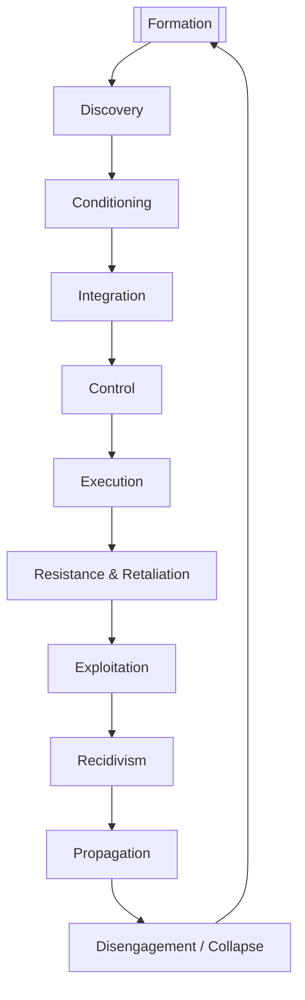

# SAFE-T Abuse Lifecycle (Expanded)

This document outlines the full SAFE-T lifecycle of abuse, combining psychological, behavioural, and technological patterns. Inspired by models like the Intelligence Lifecycle, Cyber Kill Chain, and coercive control frameworks, this model captures how abuse forms, escalates, recurs, and spreads.

---

## Lifecycle Stages

### 1. **Formation**
Development of internal beliefs, ideologies, and justifications for abuse.
- Cognitive distortions (e.g., minimisation, externalisation
- Learned behaviour from trauma, culture, online spaces
- Entitlement narratives and ideological seeding

### 2. **Discovery (Target Identification)**
Identifying and selecting victims based on perceived vulnerability or opportunity.
- Observing behaviour or emotional availability
- Exploiting open social networks or platforms
- Social engineering of gatekeepers

### 3. **Conditioning**
Grooming, testing boundaries, and establishing emotional or digital dependence.
- Love bombing and attention manipulation
- Subtle violations and trust-building
- Setting up shared accounts or digital access
### 4. **Integration**
Normalising the abuse within daily life, making the victim feel complicit, or tied into the dynamic.
- Trauma bonding and reward cycles
- Excuse-making or mutual goal entrapment
- Minimisation of harm through selective kindness

### 5. **Control**
Establishing mechanisms of coercion using emotional, physical, or technological means.
- Surveillance, location tracking, and spyware
- Password sharing framed as love/trust
- Emotional guilt and loyalty tests

### 6. **Execution**
 Delivery of actual harm — emotional, physical, financial, or digital.
- Threats of violence or exposure
- Revenge porn, blackmail, account hijacking
- Economic sabotage or deprivation

### 7. **Resistance & Retaliation**
Abuser reacts to loss of control, disclosure, or escape attempts with escalated tactics.
- Legal harassment or false reporting
- Technology escalation (new apps, spyware, tracking)
- Social smear campaigns or third-party targeting

### 8. **Exploitation**
Cover-up, evidence manipulation, or systemic abuse.
- Erasing message histories or logs
- Gaslighting others (e.g., police, therapists)
- Manipulating legal, social, or tech systems

### 9. **Recidivism**
Repeating abusive patterns with new or returning victims.
- Using previous tactics with refinement.
- Re-engaging after separation
- Normalisation of abusive behaviour

### 10. **Propagation**
Spreading abusive ideology or behaviour through influence over others (e.g., children, peers).
- Children modelling abusive dynamics
- Teaching ideology to followers or family
- Reinforcing harmful cultural patterns

### 11. **Disengagement / Collapse**
Abuse ends — either due to burnout, exposure, systemic intervention, or loss of access.
- May lead to reflection and change
- Or feeds into new cycle starting at Formation

---

##  Lifecycle Flow

